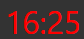
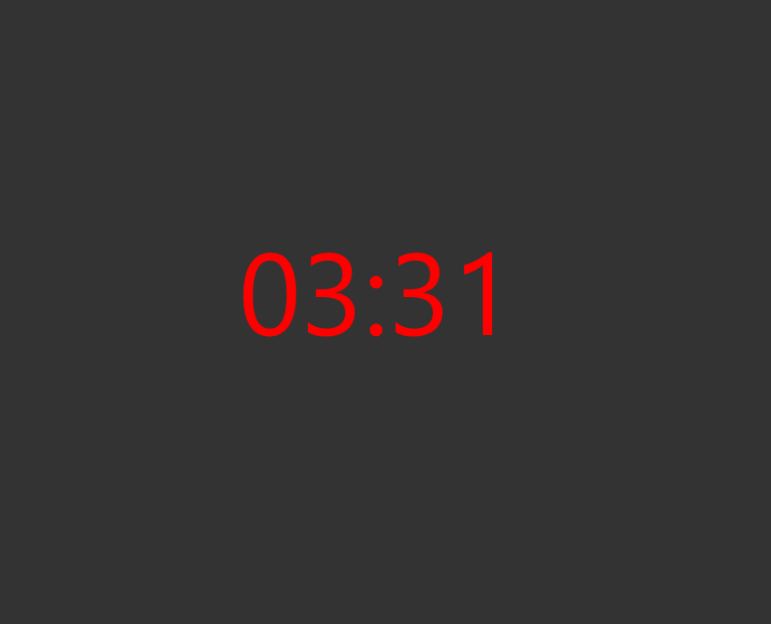

# Pomodoro
The aim of this is to help you focus on your tasks and give yourself breaks every 25 minutes.
After 4, 25 minute pomodoros a longer 30 minute break is required.

This app runs as a timer in the bottom right hand corner of your screen and stays on top of all other windows.

## Example images
Example of the timer running: 

Example of the break screen: 

Example of the the finished state: 
